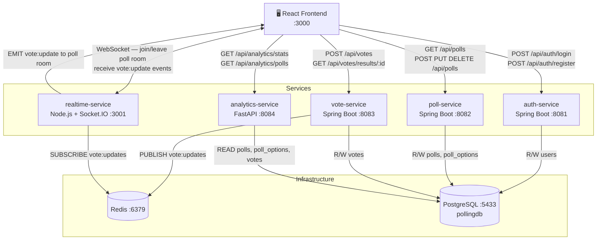

# Real-Time Polling Platform

A production-style polyglot microservices polling system with live vote updates.

## Service-to-Service Communication

```
                        ┌─────────────────────────────────────┐
                        │      Browser / React Frontend        │
                        │            Port 3000                 │
                        └──┬────────┬────────┬────────┬───┬───┘
                           │        │        │        │   │
               HTTP REST   │        │        │        │   │ WebSocket
              ─────────────┘        │        │        │   └─────────────────┐
              │                     │        │        │                     │
              │          HTTP REST  │        │        │ HTTP REST           │
              │         ───────────-┘        │        └──────────────       │
              │         │                    │ HTTP REST             │       │
              │         │                    └───────────────        │       │
              │         │                                   │        │       │
              ▼         ▼                    ▼              ▼        ▼       │
        ┌──────────┐ ┌──────────┐    ┌──────────┐   ┌──────────┐   │       │
        │   auth   │ │  poll    │    │  vote    │   │analytics │   │       │
        │ service  │ │ service  │    │ service  │   │ service  │   │       │
        │:8081     │ │:8082     │    │:8083     │   │:8084     │   │       │
        │Spring    │ │Spring    │    │Spring    │   │FastAPI   │   │       │
        │Boot +JWT │ │Boot +JWT │    │Boot      │   │Python    │   │       │
        └────┬─────┘ └────┬─────┘    └────┬─────┘   └────┬─────┘   │       │
             │            │               │               │          │       │
             │            │    PUBLISH    │               │          │       │
             │            │  vote:updates │               │          │       │
             │            │          ┌───▼───┐            │          │       │
             │            │          │       │            │          │       │
             │            │          │ Redis │            │          │       │
             │            │          │ :6379 │            │          │       │
             │            │          │       │            │          │       │
             │            │          └───────┘            │          │       │
             │            │              │ SUBSCRIBE       │          │       │
             │            │              │ vote:updates    │          │       │
             │            │              ▼                 │          │       │
             │            │       ┌──────────┐             │          │       │
             │            │       │ realtime │◄────────────┘          │       │
             │            │       │ service  │                         │       │
             │            │       │ :3001    │◄────────────────────────┘       │
             │            │       │ Node.js  │                                 │
             │            │       │Socket.IO │─────── WebSocket push ──────────►
             │            │       └──────────┘    (vote:update events)
             │            │
             ▼            ▼               ▼               ▼
        ┌────────────────────────────────────────────────────────┐
        │                  PostgreSQL  Port 5433                  │
        ├──────────┬────────────────────────┬────────────────────┤
        │  users   │  polls  │ poll_options  │       votes        │
        │(auth-svc)│      (poll-service)     │   (vote-service)   │
        │          │                         │  analytics (READ)  │
        └──────────┴─────────────────────────┴────────────────────┘
```

## Communication Flow Diagram (Mermaid)



## Service Responsibilities

| Service | Tech | Port | Owns | Communicates With |
|---------|------|------|------|-------------------|
| **auth-service** | Spring Boot | 8081 | `users` table | PostgreSQL |
| **poll-service** | Spring Boot | 8082 | `polls`, `poll_options` tables | PostgreSQL |
| **vote-service** | Spring Boot | 8083 | `votes` table | PostgreSQL, Redis (publish) |
| **analytics-service** | FastAPI (Python) | 8084 | — (read-only) | PostgreSQL |
| **realtime-service** | Node.js + Socket.IO | 3001 | — (stateless) | Redis (subscribe), Browser (WebSocket) |
| **frontend** | React | 3000 | — | All 5 services above |

## Key Communication Patterns

### 1. Authentication (Request/Response)
```
Browser ──POST /api/auth/login──► auth-service ──► PostgreSQL
Browser ◄─── JWT token ──────────────────────────────────────
```
JWT is stored in `localStorage` and attached as `Authorization: Bearer <token>` on every subsequent request to poll-service.

### 2. Live Vote Update (Event-Driven)
```
Browser ──POST /api/votes──► vote-service ──► PostgreSQL (INSERT)
                                         └──► Redis PUBLISH vote:updates
                                                  │
realtime-service ◄── Redis SUBSCRIBE ─────────────┘
Browser ◄──────────── WebSocket EMIT vote:update ──┘
```

### 3. Poll Management (REST CRUD)
```
Browser ──GET  /api/polls        ──► poll-service (public)
Browser ──POST /api/polls        ──► poll-service (JWT required → ROLE_ADMIN)
Browser ──PUT  /api/polls/:id/activate ──► poll-service (JWT required)
Browser ──DELETE /api/polls/:id  ──► poll-service (JWT required)
```

### 4. Analytics (Read-Only Aggregation)
```
Browser ──GET /api/analytics/stats   ──► analytics-service ──► PostgreSQL (SELECT)
Browser ──GET /api/analytics/polls   ──► analytics-service ──► PostgreSQL (SELECT)
Browser ──GET /api/analytics/polls/:id──► analytics-service ──► PostgreSQL (SELECT)
```

## Services

| Service | Technology | Port | Responsibility |
|---------|-----------|------|----------------|
| auth-service | Spring Boot | 8081 | JWT authentication, admin management |
| poll-service | Spring Boot | 8082 | Poll CRUD, option management |
| vote-service | Spring Boot | 8083 | Vote processing, Redis pub/sub |
| analytics-service | FastAPI (Python) | 8084 | Stats, aggregation, reporting |
| realtime-service | Node.js + Socket.IO | 3001 | WebSocket, live updates |
| frontend | React | 3000 | Admin dashboard, public voting UI |

## Quick Start

### Prerequisites
- Docker & Docker Compose
- Java 17+
- Python 3.11+
- Node.js 18+

### Run with Docker Compose

```bash
docker-compose up -d
docker-compose logs -f
```

### Run Locally

```bash
# 1. Start Redis
docker-compose -f docker-compose.redis.yml up -d

# 2. auth-service
cd auth-service && ./mvnw spring-boot:run

# 3. poll-service
cd poll-service && ./mvnw spring-boot:run

# 4. vote-service
cd vote-service && ./mvnw spring-boot:run

# 5. analytics-service
cd analytics-service
pip install -r requirements.txt
python -m uvicorn app.main:app --host 0.0.0.0 --port 8084 --reload

# 6. realtime-service
cd realtime-service && npm install && npm start

# 7. frontend
cd frontend && npm install && npm start
```

### Access Points
- **Frontend**: http://localhost:3000
- **Analytics**: http://localhost:3000/analytics
- **Auth API**: http://localhost:8081/api/auth
- **Poll API**: http://localhost:8082/api/polls
- **Vote API**: http://localhost:8083/api/votes
- **Analytics API**: http://localhost:8084/api/analytics
- **WebSocket**: ws://localhost:3001

## Shared Database

All services share **one PostgreSQL database** (`pollingdb`) but each owns its own tables:

```
pollingdb
├── users          ← auth-service (R/W)
├── polls          ← poll-service (R/W)
├── poll_options   ← poll-service (R/W)
└── votes          ← vote-service (R/W), analytics-service (R)
```

## Application Flow

1. Admin logs in at `/login` → auth-service issues JWT
2. Admin creates a poll → poll-service stores in PostgreSQL
3. Admin activates poll → visible at `localhost:3000`
4. Public user opens poll → vote-service returns current results
5. User votes → vote-service saves to DB, publishes to Redis `vote:updates`
6. realtime-service receives Redis event, broadcasts via WebSocket to all clients in that poll room
7. All browsers on that poll page update live charts instantly
8. Analytics available at `localhost:3000/analytics`
