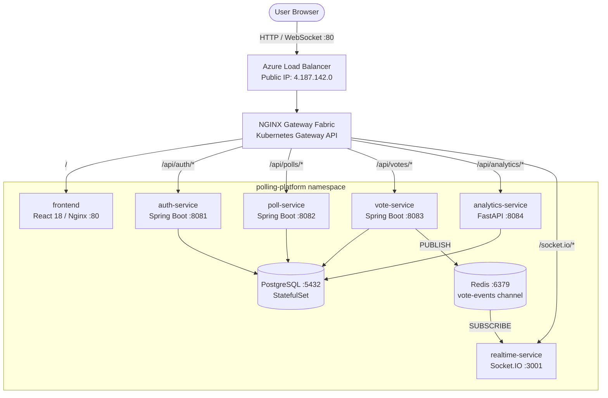
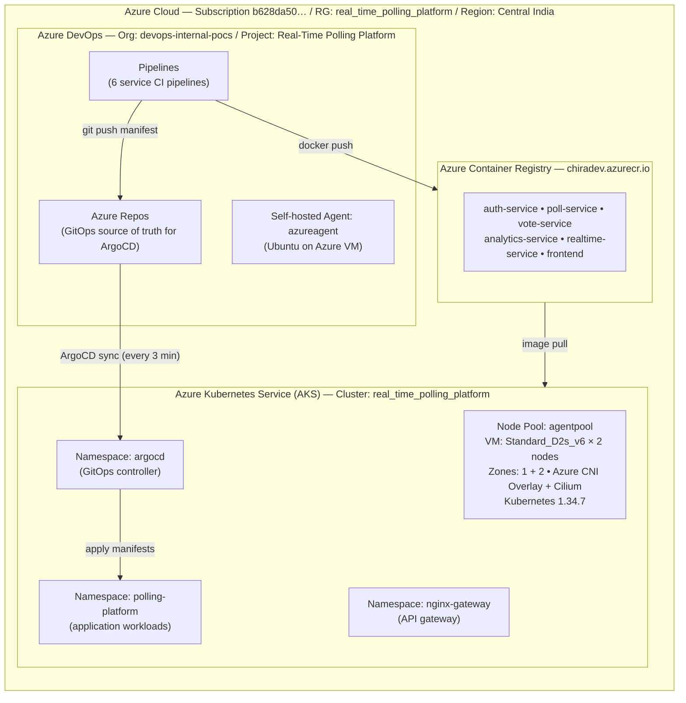
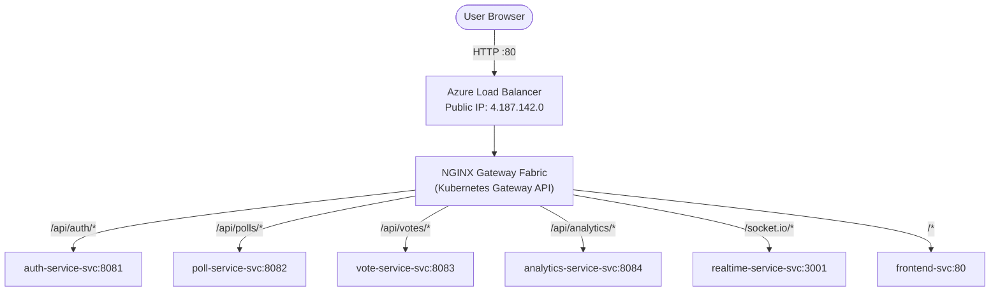
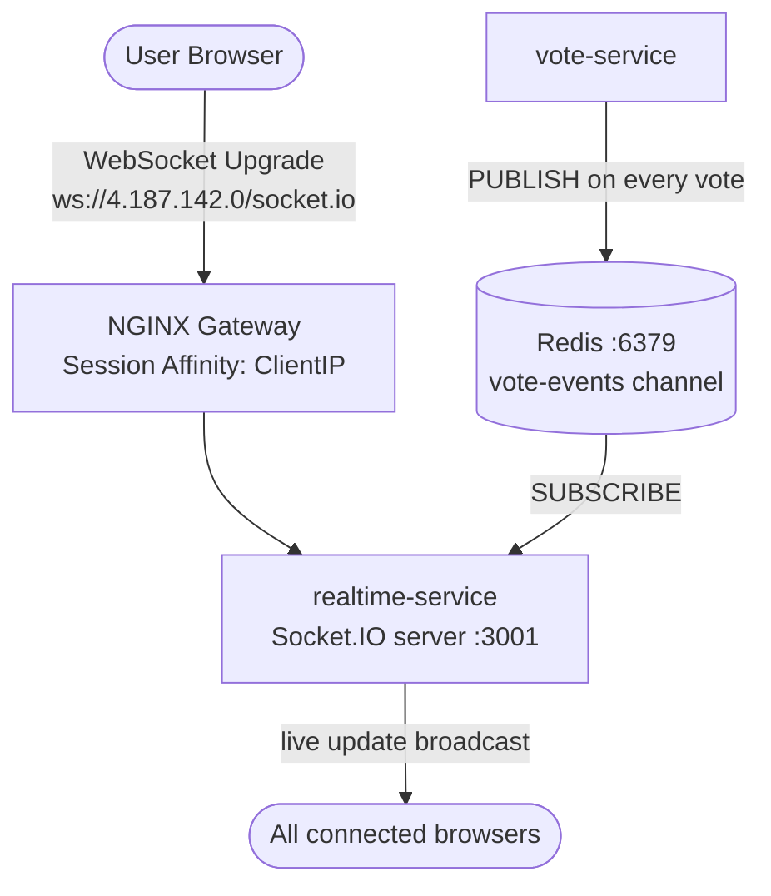
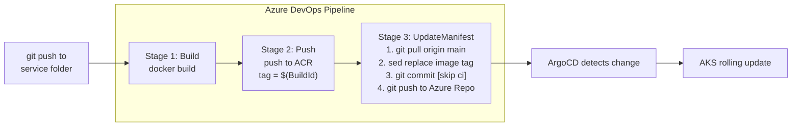
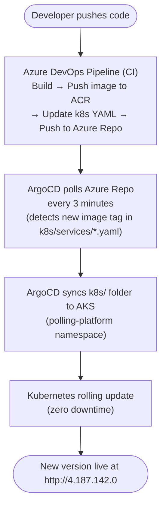

# PollStream — Real-Time Polling Platform

A production-grade, cloud-native polling platform built on **polyglot microservices**, deployed on **Azure Kubernetes Service (AKS)** with a fully automated **GitOps CI/CD pipeline** using **Azure DevOps** and **ArgoCD**.

---

## Table of Contents

- [Application Overview](#application-overview)
- [Technology Stack](#technology-stack)
- [Application Architecture](#application-architecture)
- [Cloud Infrastructure Architecture](#cloud-infrastructure-architecture)
- [Networking & Traffic Flow](#networking--traffic-flow)
- [Azure DevOps CI/CD Pipeline](#azure-devops-cicd-pipeline)
- [GitOps with ArgoCD](#gitops-with-argocd)
- [Kubernetes Resources](#kubernetes-resources)
- [Monitoring](#monitoring)
- [Application Screenshots](#application-screenshots)
- [Local Development](#local-development)

---

## Application Overview

PollStream allows admins to create real-time polls and users to vote and see live results update instantly via WebSockets. The platform is split into independent microservices, each built in the language best suited for its job.

**Live URL:** `http://4.187.142.0`

| Role | Credentials |
|---|---|
| Admin | `admin` / `Admin1234!` |

---

## Technology Stack

### Services

| Service | Language / Framework | Port | Responsibility |
|---|---|---|---|
| auth-service | Java 17 / Spring Boot 3 | 8081 | JWT authentication, user management |
| poll-service | Java 17 / Spring Boot 3 | 8082 | Poll CRUD, lifecycle management |
| vote-service | Java 17 / Spring Boot 3 | 8083 | Vote recording, Redis pub/sub |
| analytics-service | Python 3.11 / FastAPI | 8084 | Aggregation, statistics |
| realtime-service | Node.js 20 / Socket.IO | 3001 | WebSocket, live vote broadcasting |
| frontend | React 18 / Nginx | 80 | Admin dashboard, voting UI, live charts |

### Infrastructure

| Component | Technology |
|---|---|
| Container Orchestration | Azure Kubernetes Service (AKS) 1.34.7 |
| Container Registry | Azure Container Registry (ACR) |
| CI/CD | Azure DevOps Pipelines |
| GitOps / CD | ArgoCD v3.4.2 |
| API Gateway | NGINX Gateway Fabric v1.5.1 (Kubernetes Gateway API) |
| Database | PostgreSQL 16 (StatefulSet, managed-csi disk) |
| Cache / Message Broker | Redis 7 |
| Network Policy | Cilium (Azure CNI Overlay) |
| Source Control | Azure Repos + GitHub (mirrored) |

---

## Application Architecture



### Service Communication

- **auth-service** — Issues and validates JWT tokens. All services validate tokens via Spring Security.
- **poll-service** — Manages poll lifecycle (create, activate, close). Writes to PostgreSQL.
- **vote-service** — Records votes in PostgreSQL, publishes vote events to Redis pub/sub channel.
- **analytics-service** — Reads from PostgreSQL to serve aggregated statistics.
- **realtime-service** — Subscribes to Redis channel, broadcasts vote events to connected browsers over WebSocket.
- **frontend** — React SPA served by Nginx. Connects to backend via Gateway using relative URLs.

---

## Cloud Infrastructure Architecture



---

## Networking & Traffic Flow

### External Traffic Flow



### WebSocket (Real-Time) Flow



### Network CIDRs

| Resource | Value |
|---|---|
| Pod network CIDR | `10.244.0.0/16` |
| Service network CIDR | `10.0.0.0/16` |
| DNS service IP | `10.0.0.10` |
| External Load Balancer | `4.187.142.0` |

### Kubernetes Services

| Service | Type | Port |
|---|---|---|
| polling-gateway-nginx | LoadBalancer (external) | 80 |
| frontend-svc | ClusterIP | 80 |
| auth-service-svc | ClusterIP | 8081 |
| poll-service-svc | ClusterIP | 8082 |
| vote-service-svc | ClusterIP | 8083 |
| analytics-service-svc | ClusterIP | 8084 |
| realtime-service-svc | ClusterIP (SessionAffinity) | 3001 |
| postgres-svc | Headless ClusterIP | 5432 |
| redis-svc | ClusterIP | 6379 |

---

## Azure DevOps CI/CD Pipeline


### Pipeline Overview

Each microservice has its own independent pipeline triggered by changes to its source folder. All 6 pipelines follow the same 3-stage pattern:




### Pipeline Files

```
azure-pipelines/
├── auth-service-pipeline.yml
├── poll-service-pipeline.yml
├── vote-service-pipeline.yml
├── analytics-service-pipeline.yml
├── realtime-service-pipeline.yml
└── frontend-pipeline.yml
```

### UpdateManifest Stage Script

```bash
git config user.email "azuredevops@pollstream.com"
git config user.name "Azure DevOps CI"
git fetch origin && git checkout main && git pull origin main

# Replace old tag with new BuildId
sed -i "s|image: chiradev.azurecr.io/auth-service:.*\
       |image: chiradev.azurecr.io/auth-service:$(tag)|g" \
       k8s/services/auth-service.yaml

# Commit only if file changed (prevents empty commits)
git add k8s/services/auth-service.yaml
git diff --staged --quiet || \
  git commit -m "ci: update auth-service image tag to $(tag) [skip ci]"

git push origin main
```

> `[skip ci]` prevents the commit from triggering the pipeline again.

### Azure Container Registry


Images are tagged with the **Azure DevOps Build ID** — a unique, always-incrementing number per pipeline run. Never use `latest` in production.

| Repository | Purpose |
|---|---|
| `auth-service` | Authentication service image |
| `poll-service` | Poll management service image |
| `vote-service` | Vote recording service image |
| `analytics-service-app` | Analytics service image |
| `realtime-service` | WebSocket service image |
| `frontend` | React app (Nginx) image |

### Azure Repos


Azure DevOps Repos is the **GitOps source of truth**. GitHub is a public mirror.

```bash
# Two remotes — always push to both
git push origin main   # GitHub (public mirror)
git push azure main    # Azure Repos (ArgoCD watches this)
```

> After each pipeline run the pipeline commits back to Azure Repo, so always pull before pushing:
> ```bash
> git pull azure main --rebase
> git pull origin main --rebase
> ```

### Required Azure DevOps Permission

For the UpdateManifest stage to push back to the repo:

> **Project Settings → Repositories → Security →
> `<Project> Build Service` → Contribute → Allow**

---

## GitOps with ArgoCD


### GitOps Flow



### ArgoCD Application

```yaml
Source:
  repoURL: https://dev.azure.com/devops-internal-pocs/...
  path: k8s/
  targetRevision: main
  directory:
    recurse: true
Destination:
  namespace: polling-platform
syncPolicy:
  automated:
    prune: true
    selfHeal: true
```


### ArgoCD Rollback

If a bad deployment is released, ArgoCD lets you roll back to any previous Git commit instantly — the cluster always reflects Git state.


---

## Kubernetes Resources


### Live Cluster State

```
$ kubectl get all -n polling-platform

NAME                                         READY   STATUS    RESTARTS   AGE
pod/analytics-service-7b9c969f7d-whtnh       1/1     Running   0          91m
pod/auth-service-645df6d866-7fm7g            1/1     Running   0          2m5s
pod/auth-service-645df6d866-cqbnt            1/1     Running   0          3m
pod/frontend-75df75b87f-jfq66                1/1     Running   0          10m
pod/frontend-75df75b87f-rbd4j                1/1     Running   0          10m
pod/poll-service-d4d94c9bb-hdqdp             1/1     Running   0          132m
pod/poll-service-d4d94c9bb-mg5qz             1/1     Running   0          131m
pod/polling-gateway-nginx-6946c84d45-whm6l   0/1     Running   0          156m
pod/polling-gateway-nginx-fbfdc9f46-sqfd9    0/1     Running   0          161m
pod/postgres-0                               1/1     Running   0          133m
pod/realtime-service-869d655f4f-pg6wk        1/1     Running   0          156m
pod/realtime-service-869d655f4f-srv77        1/1     Running   0          130m
pod/redis-6854fd6dc8-kj752                   1/1     Running   0          156m
pod/vote-service-6b89f86475-8wzps            1/1     Running   0          130m
pod/vote-service-6b89f86475-zbbzk            1/1     Running   0          132m

NAME                            TYPE           CLUSTER-IP     EXTERNAL-IP    PORT(S)        AGE
service/analytics-service-svc   ClusterIP      10.0.166.36    <none>         8084/TCP       161m
service/auth-service-svc        ClusterIP      10.0.190.205   <none>         8081/TCP       161m
service/frontend-svc            ClusterIP      10.0.61.196    <none>         80/TCP         161m
service/poll-service-svc        ClusterIP      10.0.176.49    <none>         8082/TCP       161m
service/polling-gateway-nginx   LoadBalancer   10.0.214.141   4.187.142.0    80:30979/TCP   161m
service/postgres-svc            ClusterIP      None           <none>         5432/TCP       161m
service/realtime-service-svc    ClusterIP      10.0.57.181    <none>         3001/TCP       161m
service/redis-svc               ClusterIP      10.0.30.254    <none>         6379/TCP       161m
service/vote-service-svc        ClusterIP      10.0.250.26    <none>         8083/TCP       161m

NAME                                    READY   UP-TO-DATE   AVAILABLE   AGE
deployment.apps/analytics-service       1/1     1            1           161m
deployment.apps/auth-service            2/2     2            2           161m
deployment.apps/frontend                2/2     2            2           161m
deployment.apps/poll-service            2/2     2            2           161m
deployment.apps/polling-gateway-nginx   0/1     1            0           161m
deployment.apps/realtime-service        2/2     2            2           161m
deployment.apps/redis                   1/1     1            1           161m
deployment.apps/vote-service            2/2     2            2           161m

NAME                        READY   AGE
statefulset.apps/postgres   1/1     161m
```

### Workloads

| Workload | Kind | Replicas |
|---|---|---|
| frontend | Deployment | 2 |
| auth-service | Deployment | 2 |
| poll-service | Deployment | 2 |
| vote-service | Deployment | 2 |
| analytics-service | Deployment | 1 |
| realtime-service | Deployment | 2 |
| redis | Deployment | 1 |
| postgres | StatefulSet | 1 |

### AKS Cluster Specs

| Property | Value |
|---|---|
| Cluster Name | real_time_polling_platform |
| Region | Central India |
| Kubernetes Version | 1.34.7 |
| VM Size | Standard_D2s_v6 (2 vCPU, 8 GB RAM) |
| Node Count | 2 nodes |
| Availability Zones | Zone 1 + Zone 2 |
| Max Pods/Node | 60 |
| OS | Ubuntu 22.04 |
| Network Plugin | Azure CNI Overlay |
| Network Policy | Cilium |
| Auto-upgrade | Patch channel |
| Storage | managed-csi (Azure Disk) for PostgreSQL |

### Kubernetes Folder Structure

```
k8s/
├── 00-namespace.yaml          # polling-platform namespace
├── 01-secrets.yaml            # PostgreSQL, Redis, JWT secrets
├── 02-configmap.yaml          # Service config (DB URLs, Redis host)
├── gateway/
│   ├── gateway.yaml           # NGINX Gateway (HTTP :80, no TLS)
│   └── httproutes.yaml        # Path-based routing rules
├── infrastructure/
│   ├── postgres.yaml          # StatefulSet + PVC (10Gi managed-csi)
│   └── redis.yaml             # Deployment + ClusterIP Service
└── services/
    ├── auth-service.yaml
    ├── poll-service.yaml
    ├── vote-service.yaml
    ├── analytics-service.yaml
    ├── realtime-service.yaml
    └── frontend.yaml
```

---

## Monitoring

Azure Monitor is enabled on the AKS cluster with Prometheus metrics collection via kube-state-metrics.


---

## Application Screenshots

### Public Voting Page


### Vote Page with Live Results


### Admin Dashboard


### Analytics


---

## Local Development

### Prerequisites

- Docker Desktop
- Java 17 + Maven
- Python 3.11 + pip
- Node.js 20

### Run with Docker Compose

```bash
cp .env.example .env       # fill in secrets
docker-compose up -d       # starts all 8 services
```

| Service | Local URL |
|---|---|
| Frontend | http://localhost:3000 |
| Auth | http://localhost:8081 |
| Poll | http://localhost:8082 |
| Vote | http://localhost:8083 |
| Analytics | http://localhost:8084 |
| Realtime | http://localhost:3001 |

### Connect to AKS

```bash
az account set --subscription b628da50-7030-44d1-aba4-dab3ea3f29eb
az aks get-credentials \
  --resource-group real_time_polling_platform \
  --name real_time_polling_platform
kubectl get pods -n polling-platform
```

---

## Project Structure

```
cloud-native-polling-platform/
│
├── auth-service/                              # Spring Boot — JWT auth & user management
│   ├── src/main/java/com/polling/auth/
│   │   ├── AuthServiceApplication.java
│   │   ├── config/SecurityConfig.java
│   │   ├── controller/AuthController.java
│   │   ├── dto/                               # AuthResponse, LoginRequest, RegisterRequest
│   │   ├── entity/User.java
│   │   ├── exception/                         # AuthException, GlobalExceptionHandler
│   │   ├── repository/UserRepository.java
│   │   ├── security/                          # JwtAuthenticationFilter, JwtTokenProvider, UserDetailsServiceImpl
│   │   └── service/AuthService.java
│   ├── src/main/resources/
│   │   ├── application.yml
│   │   └── data.sql
│   ├── Dockerfile
│   ├── pom.xml
│   └── README.md
│
├── poll-service/                              # Spring Boot — Poll lifecycle management
│   ├── src/main/java/com/polling/polls/
│   │   ├── PollServiceApplication.java
│   │   ├── config/SecurityConfig.java
│   │   ├── controller/PollController.java
│   │   ├── dto/                               # CreatePollRequest, PollOptionDto, PollResponse
│   │   ├── entity/                            # Poll, PollOption, PollStatus
│   │   ├── exception/                         # GlobalExceptionHandler, PollNotFoundException
│   │   ├── repository/                        # PollRepository, PollOptionRepository
│   │   ├── security/                          # JwtAuthenticationFilter, JwtTokenProvider
│   │   └── service/PollService.java
│   ├── src/main/resources/application.yml
│   ├── Dockerfile
│   └── pom.xml
│
├── vote-service/                              # Spring Boot — Voting + Redis pub/sub
│   ├── src/main/java/com/polling/votes/
│   │   ├── VoteServiceApplication.java
│   │   ├── config/                            # RedisConfig, WebConfig
│   │   ├── controller/VoteController.java
│   │   ├── dto/                               # VoteRequest, VoteResponse
│   │   ├── entity/Vote.java
│   │   ├── exception/                         # DuplicateVoteException, GlobalExceptionHandler
│   │   ├── repository/VoteRepository.java
│   │   └── service/VoteService.java
│   ├── src/main/resources/application.yml
│   ├── Dockerfile
│   └── pom.xml
│
├── analytics-service/                         # FastAPI — Statistics & aggregation
│   ├── app/
│   │   ├── __init__.py
│   │   ├── config.py
│   │   ├── database.py
│   │   ├── models/models.py                   # SQLAlchemy ORM models
│   │   ├── routers/analytics.py               # API endpoints
│   │   ├── schemas/schemas.py                 # Pydantic schemas
│   │   └── services/analytics_service.py      # Business logic
│   ├── main.py
│   ├── requirements.txt
│   ├── test_db_connection.py
│   ├── Dockerfile
│   └── README.md
│
├── realtime-service/                          # Node.js + Socket.IO — WebSocket broadcasting
│   ├── src/
│   │   ├── index.js
│   │   ├── config/redis.js
│   │   └── socket/socketHandler.js
│   ├── package.json
│   ├── package-lock.json
│   └── Dockerfile
│
├── frontend/                                  # React 18 + Nginx — Voting UI & Admin dashboard
│   ├── public/index.html
│   ├── src/
│   │   ├── index.js
│   │   ├── App.js
│   │   ├── api/axios.js                       # Axios instance + interceptors
│   │   ├── components/                        # CreatePollModal, LoadingSpinner, Navbar, ProtectedRoute
│   │   ├── context/AuthContext.js
│   │   ├── pages/                             # Login, PollList, VotePage, AdminDashboard, Analytics, PlatformAnalytics
│   │   └── styles/global.css
│   ├── nginx.conf                             # SPA routing + reverse-proxy config
│   ├── package.json
│   ├── package-lock.json
│   └── Dockerfile
│
├── k8s/                                       # Kubernetes manifests (ArgoCD source of truth)
│   ├── 00-namespace.yaml                      # polling-platform namespace
│   ├── 01-secrets.yaml                        # PostgreSQL, Redis, JWT secrets
│   ├── 02-configmap.yaml                      # Service config (DB URLs, Redis host)
│   ├── gateway/
│   │   ├── gatewayclass.yaml
│   │   ├── gateway.yaml                       # NGINX Gateway (HTTP :80, no TLS)
│   │   └── httproutes.yaml                    # Path-based routing rules
│   ├── infrastructure/
│   │   ├── postgres.yaml                      # StatefulSet + PVC (10Gi managed-csi)
│   │   └── redis.yaml                         # Deployment + ClusterIP Service
│   └── services/
│       ├── auth-service.yaml
│       ├── poll-service.yaml
│       ├── vote-service.yaml
│       ├── analytics-service.yaml
│       ├── realtime-service.yaml
│       └── frontend.yaml
│
├── azure-pipelines/                           # Azure DevOps CI pipeline definitions
│   ├── auth-service-pipeline.yml
│   ├── poll-service-pipeline.yml
│   ├── vote-service-pipeline.yml
│   ├── analytics-service-pipeline.yml
│   ├── realtime-service-pipeline.yml
│   └── frontend-service-pipeline.yml
│
├── docs/                                      # Architecture diagrams & screenshots
│
├── docker-compose.yml                         # Local development — all services
├── docker-compose.redis.yml                   # Redis-only override for partial local runs
├── init-db.sql                                # Database schema seed
├── .gitignore
└── README.md
```
