# PollStream — Real-Time Polling Platform

A production-grade, cloud-native polling platform built on **polyglot microservices**, deployed on **Azure Kubernetes Service (AKS)** with a fully automated **GitOps CI/CD pipeline** using **Azure DevOps** and **ArgoCD**.

---

## Table of Contents

- [Application Overview](#application-overview)
- [Technology Stack](#technology-stack)
- [Application Architecture](#application-architecture)
- [Cloud Infrastructure Architecture](#cloud-infrastructure-architecture)
- [Networking & Traffic Flow](#networking--traffic-flow)
- [Azure DevOps CI/CD Pipeline](#azure-devops-cicd-pipeline)
- [GitOps with ArgoCD](#gitops-with-argocd)
- [Kubernetes Resources](#kubernetes-resources)
- [Monitoring](#monitoring)
- [Application Screenshots](#application-screenshots)
- [Local Development](#local-development)

---

## Application Overview

PollStream allows admins to create real-time polls and users to vote and see live results update instantly via WebSockets. The platform is split into independent microservices, each built in the language best suited for its job.

**Live URL:** `http://4.187.142.0`

| Role | Credentials |
|---|---|
| Admin | `admin` / `Admin1234!` |

---

## Technology Stack

### Services

| Service | Language / Framework | Port | Responsibility |
|---|---|---|---|
| auth-service | Java 17 / Spring Boot 3 | 8081 | JWT authentication, user management |
| poll-service | Java 17 / Spring Boot 3 | 8082 | Poll CRUD, lifecycle management |
| vote-service | Java 17 / Spring Boot 3 | 8083 | Vote recording, Redis pub/sub |
| analytics-service | Python 3.11 / FastAPI | 8084 | Aggregation, statistics |
| realtime-service | Node.js 20 / Socket.IO | 3001 | WebSocket, live vote broadcasting |
| frontend | React 18 / Nginx | 80 | Admin dashboard, voting UI, live charts |

### Infrastructure

| Component | Technology |
|---|---|
| Container Orchestration | Azure Kubernetes Service (AKS) 1.34.7 |
| Container Registry | Azure Container Registry (ACR) |
| CI/CD | Azure DevOps Pipelines |
| GitOps / CD | ArgoCD v3.4.2 |
| API Gateway | NGINX Gateway Fabric v1.5.1 (Kubernetes Gateway API) |
| Database | PostgreSQL 16 (StatefulSet, managed-csi disk) |
| Cache / Message Broker | Redis 7 |
| Network Policy | Cilium (Azure CNI Overlay) |
| Source Control | Azure Repos + GitHub (mirrored) |

---

## Application Architecture

```
                         ┌─────────────────────────────────────────────────────┐
                         │              polling-platform namespace               │
                         │                                                       │
  Browser / Client       │  ┌──────────┐   ┌──────────────┐   ┌─────────────┐  │
       │                 │  │ frontend │   │ auth-service │   │ poll-service│  │
       │  HTTP/WS        │  │  :80     │   │    :8081     │   │    :8082    │  │
       ▼                 │  └──────────┘   └──────────────┘   └─────────────┘  │
  ┌──────────┐           │        │               │                  │          │
  │ Gateway  │           │        └───────────────┴──────────────────┘          │
  │  NGINX   │──────────▶│  ┌──────────────┐   ┌──────────────┐                │
  │ Fabric   │           │  │ vote-service │   │  analytics   │                │
  │  :80     │           │  │    :8083     │   │   -service   │                │
  └──────────┘           │  └──────┬───────┘   │    :8084     │                │
       │                 │         │           └──────────────┘                │
       │ /socket.io      │         │ pub/sub                                   │
       ▼                 │  ┌──────▼───────┐   ┌──────────────┐                │
  ┌──────────┐           │  │    Redis     │   │  PostgreSQL  │                │
  │ realtime │           │  │    :6379     │   │    :5432     │                │
  │ -service │◀──────────│  └──────┬───────┘   └──────────────┘                │
  │   :3001  │           │         │                                            │
  └──────────┘           │  ┌──────▼───────┐                                   │
       │                 │  │   realtime   │                                   │
       │ WebSocket       │  │   -service   │                                   │
       ▼                 │  │    :3001     │                                   │
  Browser Live Updates   │  └──────────────┘                                   │
                         └─────────────────────────────────────────────────────┘
```

### Service Communication

- **auth-service** — Issues and validates JWT tokens. All services validate tokens via Spring Security.
- **poll-service** — Manages poll lifecycle (create, activate, close). Writes to PostgreSQL.
- **vote-service** — Records votes in PostgreSQL, publishes vote events to Redis pub/sub channel.
- **analytics-service** — Reads from PostgreSQL to serve aggregated statistics.
- **realtime-service** — Subscribes to Redis channel, broadcasts vote events to connected browsers over WebSocket.
- **frontend** — React SPA served by Nginx. Connects to backend via Gateway using relative URLs.

---

## Cloud Infrastructure Architecture

```
  ┌──────────────────────────────────────────────────────────────────────────┐
  │                         AZURE CLOUD                                      │
  │                                                                          │
  │  Subscription: b628da50-7030-44d1-aba4-dab3ea3f29eb                     │
  │  Resource Group: real_time_polling_platform / Region: Central India      │
  │                                                                          │
  │  ┌──────────────────────┐    ┌──────────────────────────────────────┐   │
  │  │  Azure Container     │    │  Azure Kubernetes Service (AKS)      │   │
  │  │  Registry (ACR)      │    │  Cluster: real_time_polling_platform  │   │
  │  │  chiradev.azurecr.io │    │  Kubernetes: 1.34.7                  │   │
  │  │                      │    │                                      │   │
  │  │  • auth-service      │    │  Node Pool: agentpool                │   │
  │  │  • poll-service      │    │  VM: Standard_D2s_v6 × 2 nodes       │   │
  │  │  • vote-service      │    │  Zones: Zone 1 + Zone 2              │   │
  │  │  • analytics-service │    │  Network: Azure CNI Overlay + Cilium │   │
  │  │  • realtime-service  │    │                                      │   │
  │  │  • frontend          │    │  Namespaces:                         │   │
  │  └──────────┬───────────┘    │  • polling-platform (app workloads)  │   │
  │             │ pull images    │  • argocd        (GitOps controller) │   │
  │             └───────────────▶│  • nginx-gateway (API gateway)       │   │
  │                              └──────────────────────────────────────┘   │
  │                                                                          │
  │  ┌───────────────────────────────────────────────────────────────────┐  │
  │  │  Azure DevOps  (Subscription: c2ef2de6-5bf9-43e5-aaf8-cf47b3f4835e│  │
  │  │  Org: devops-internal-pocs / Project: Real-Time Polling Platform  │  │
  │  │                                                                   │  │
  │  │  • Azure Repos — GitOps source of truth for ArgoCD               │  │
  │  │  • Pipelines  — 6 independent service CI pipelines               │  │
  │  │  • Self-hosted Agent: azureagent (Ubuntu on Azure VM)            │  │
  │  └───────────────────────────────────────────────────────────────────┘  │
  └──────────────────────────────────────────────────────────────────────────┘
```

---

## Networking & Traffic Flow

### External Traffic Flow

```
User Browser
     │
     │  HTTP :80
     ▼
Azure Load Balancer (Public IP: 4.187.142.0)
     │
     ▼
NGINX Gateway Fabric (Kubernetes Gateway API)
     │
     │  HTTPRoute path matching:
     ├── /api/auth/*      ──▶  auth-service-svc:8081
     ├── /api/polls/*     ──▶  poll-service-svc:8082
     ├── /api/votes/*     ──▶  vote-service-svc:8083
     ├── /api/analytics/* ──▶  analytics-service-svc:8084
     ├── /socket.io/*     ──▶  realtime-service-svc:3001
     └── /*               ──▶  frontend-svc:80
```

### WebSocket (Real-Time) Flow

```
User Browser
     │
     │  WebSocket Upgrade (ws://4.187.142.0/socket.io)
     ▼
NGINX Gateway — Session Affinity: ClientIP (sticky sessions)
     ▼
realtime-service (Socket.IO server)
     │
     │  Redis SUBSCRIBE (vote-events channel)
     ▼
Redis ◀── vote-service PUBLISH (on every vote)
     │
     ▼
realtime-service pushes live update ──▶ All connected browsers
```

### Network CIDRs

| Resource | Value |
|---|---|
| Pod network CIDR | `10.244.0.0/16` |
| Service network CIDR | `10.0.0.0/16` |
| DNS service IP | `10.0.0.10` |
| External Load Balancer | `4.187.142.0` |

### Kubernetes Services

| Service | Type | Port |
|---|---|---|
| polling-gateway-nginx | LoadBalancer (external) | 80 |
| frontend-svc | ClusterIP | 80 |
| auth-service-svc | ClusterIP | 8081 |
| poll-service-svc | ClusterIP | 8082 |
| vote-service-svc | ClusterIP | 8083 |
| analytics-service-svc | ClusterIP | 8084 |
| realtime-service-svc | ClusterIP (SessionAffinity) | 3001 |
| postgres-svc | Headless ClusterIP | 5432 |
| redis-svc | ClusterIP | 6379 |

---

## Azure DevOps CI/CD Pipeline

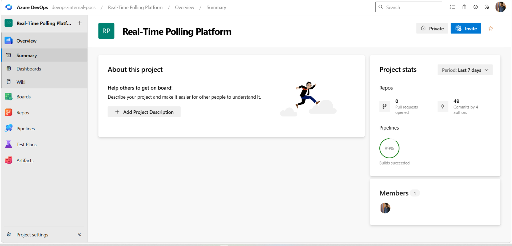

### Pipeline Overview

Each microservice has its own independent pipeline triggered by changes to its source folder. All 6 pipelines follow the same 3-stage pattern:

```
┌─────────────────────────────────────────────────────────────────────┐
│                     Azure DevOps Pipeline                            │
│                                                                     │
│  Trigger: git push to <service-name>/* folder                       │
│                                                                     │
│  ┌───────────┐     ┌───────────┐     ┌──────────────────────────┐  │
│  │  Stage 1  │     │  Stage 2  │     │        Stage 3           │  │
│  │   Build   │────▶│   Push    │────▶│     UpdateManifest       │  │
│  │           │     │           │     │                          │  │
│  │ docker    │     │ push to   │     │ 1. git pull origin main  │  │
│  │ build     │     │ ACR with  │     │ 2. sed replace image tag │  │
│  │           │     │ BuildId   │     │ 3. git commit [skip ci]  │  │
│  │           │     │ as tag    │     │ 4. git push → Azure Repo │  │
│  └───────────┘     └───────────┘     │ 5. ArgoCD detects change │  │
│                                      │ 6. AKS rolling update    │  │
│                                      └──────────────────────────┘  │
└─────────────────────────────────────────────────────────────────────┘
```

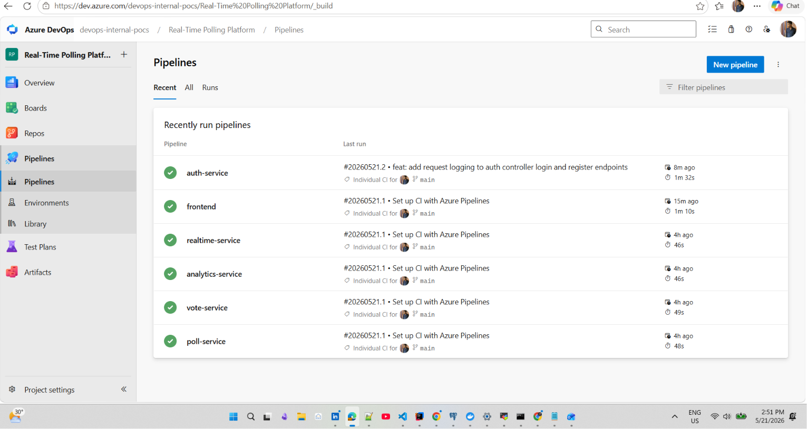

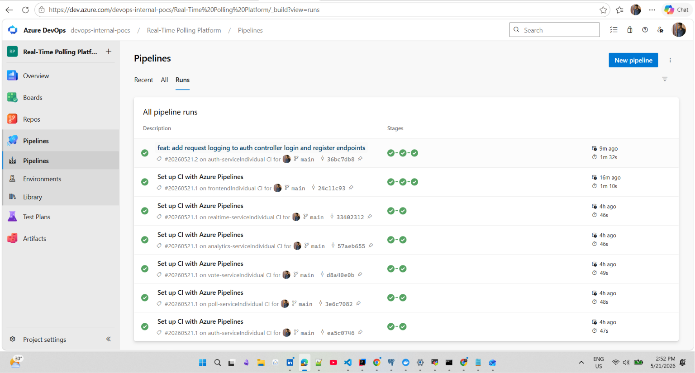

### Pipeline Files

```
azure-pipelines/
├── auth-service-pipeline.yml
├── poll-service-pipeline.yml
├── vote-service-pipeline.yml
├── analytics-service-pipeline.yml
├── realtime-service-pipeline.yml
└── frontend-pipeline.yml
```

### UpdateManifest Stage Script

```bash
git config user.email "azuredevops@pollstream.com"
git config user.name "Azure DevOps CI"
git fetch origin && git checkout main && git pull origin main

# Replace old tag with new BuildId
sed -i "s|image: chiradev.azurecr.io/auth-service:.*\
       |image: chiradev.azurecr.io/auth-service:$(tag)|g" \
       k8s/services/auth-service.yaml

# Commit only if file changed (prevents empty commits)
git add k8s/services/auth-service.yaml
git diff --staged --quiet || \
  git commit -m "ci: update auth-service image tag to $(tag) [skip ci]"

git push origin main
```

> `[skip ci]` prevents the commit from triggering the pipeline again.

### Azure Container Registry

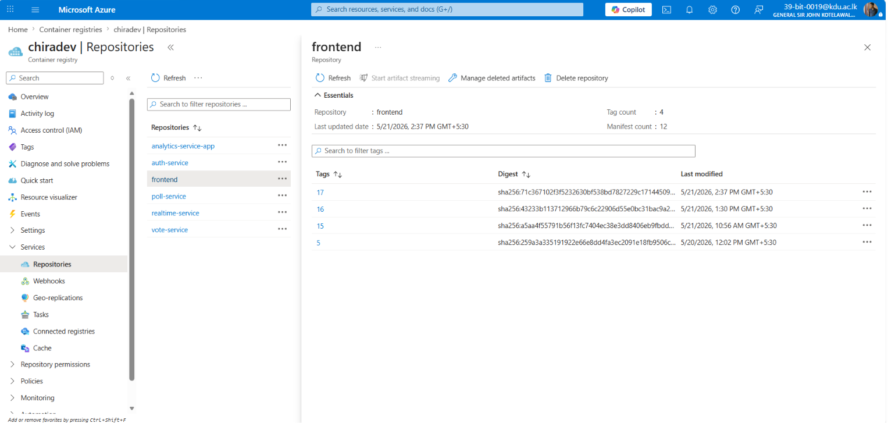

Images are tagged with the **Azure DevOps Build ID** — a unique, always-incrementing number per pipeline run. Never use `latest` in production.

| Repository | Purpose |
|---|---|
| `auth-service` | Authentication service image |
| `poll-service` | Poll management service image |
| `vote-service` | Vote recording service image |
| `analytics-service-app` | Analytics service image |
| `realtime-service` | WebSocket service image |
| `frontend` | React app (Nginx) image |

### Azure Repos

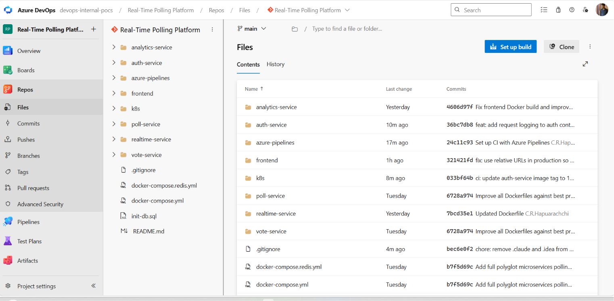

Azure DevOps Repos is the **GitOps source of truth**. GitHub is a public mirror.

```bash
# Two remotes — always push to both
git push origin main   # GitHub (public mirror)
git push azure main    # Azure Repos (ArgoCD watches this)
```

> After each pipeline run the pipeline commits back to Azure Repo, so always pull before pushing:
> ```bash
> git pull azure main --rebase
> git pull origin main --rebase
> ```

### Required Azure DevOps Permission

For the UpdateManifest stage to push back to the repo:

> **Project Settings → Repositories → Security →
> `<Project> Build Service` → Contribute → Allow**

---

## GitOps with ArgoCD

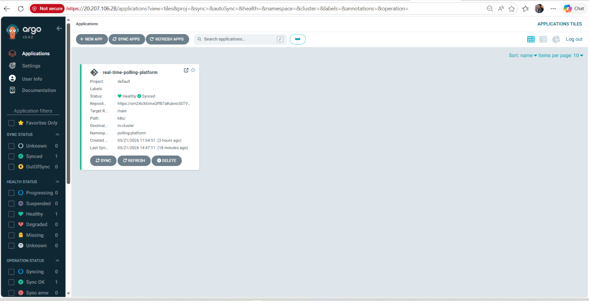

### GitOps Flow

```
Developer pushes code change
          │
          ▼
Azure DevOps Pipeline (CI)
  Build → Push image to ACR → Update k8s YAML → Push to Azure Repo
          │
          ▼
ArgoCD polls Azure Repo every 3 minutes
  Detects new image tag in k8s/services/*.yaml
          │
          ▼
ArgoCD syncs k8s/ folder to AKS cluster (polling-platform namespace)
          │
          ▼
Kubernetes performs rolling update — zero downtime
          │
          ▼
New version live at http://4.187.142.0
```

### ArgoCD Application

```yaml
Source:
  repoURL: https://dev.azure.com/devops-internal-pocs/...
  path: k8s/
  targetRevision: main
  directory:
    recurse: true
Destination:
  namespace: polling-platform
syncPolicy:
  automated:
    prune: true
    selfHeal: true
```

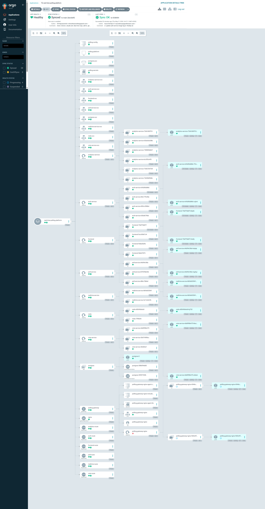

### ArgoCD Rollback

If a bad deployment is released, ArgoCD lets you roll back to any previous Git commit instantly — the cluster always reflects Git state.

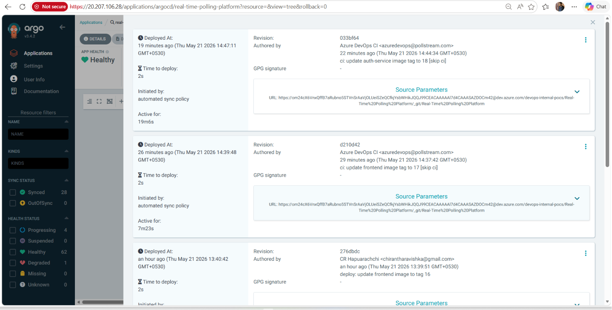

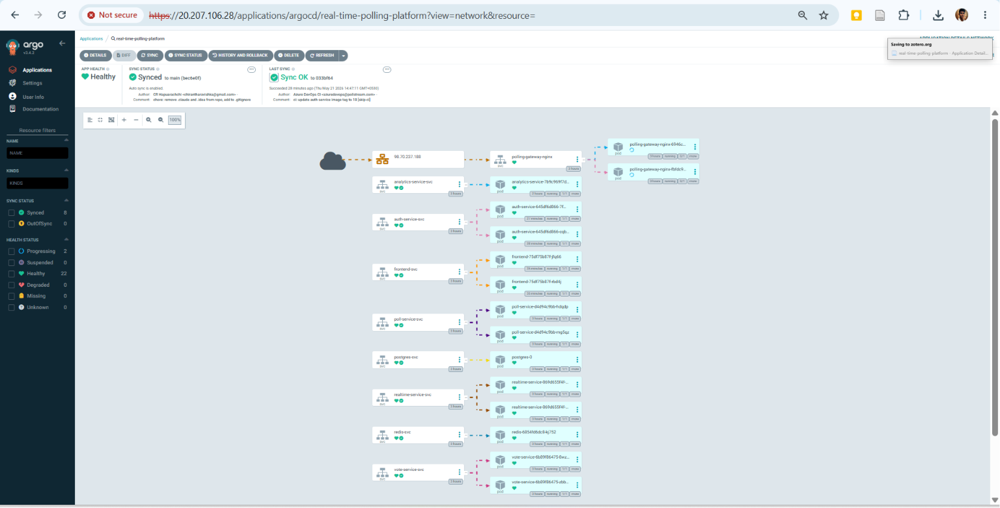

---

## Kubernetes Resources

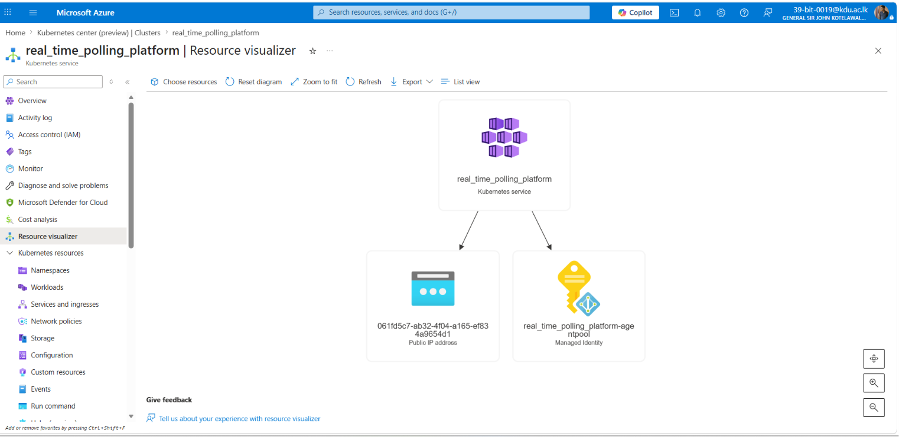

### Workloads

| Workload | Kind | Replicas |
|---|---|---|
| frontend | Deployment | 2 |
| auth-service | Deployment | 2 |
| poll-service | Deployment | 2 |
| vote-service | Deployment | 2 |
| analytics-service | Deployment | 1 |
| realtime-service | Deployment | 2 |
| redis | Deployment | 1 |
| postgres | StatefulSet | 1 |

### AKS Cluster Specs

| Property | Value |
|---|---|
| Cluster Name | real_time_polling_platform |
| Region | Central India |
| Kubernetes Version | 1.34.7 |
| VM Size | Standard_D2s_v6 (2 vCPU, 8 GB RAM) |
| Node Count | 2 nodes |
| Availability Zones | Zone 1 + Zone 2 |
| Max Pods/Node | 60 |
| OS | Ubuntu 22.04 |
| Network Plugin | Azure CNI Overlay |
| Network Policy | Cilium |
| Auto-upgrade | Patch channel |
| Storage | managed-csi (Azure Disk) for PostgreSQL |

### Kubernetes Folder Structure

```
k8s/
├── 00-namespace.yaml          # polling-platform namespace
├── 01-secrets.yaml            # PostgreSQL, Redis, JWT secrets
├── 02-configmap.yaml          # Service config (DB URLs, Redis host)
├── gateway/
│   ├── gateway.yaml           # NGINX Gateway (HTTP :80, no TLS)
│   └── httproutes.yaml        # Path-based routing rules
├── infrastructure/
│   ├── postgres.yaml          # StatefulSet + PVC (10Gi managed-csi)
│   └── redis.yaml             # Deployment + ClusterIP Service
└── services/
    ├── auth-service.yaml
    ├── poll-service.yaml
    ├── vote-service.yaml
    ├── analytics-service.yaml
    ├── realtime-service.yaml
    └── frontend.yaml
```

---

## Monitoring

Azure Monitor is enabled on the AKS cluster with Prometheus metrics collection via kube-state-metrics.

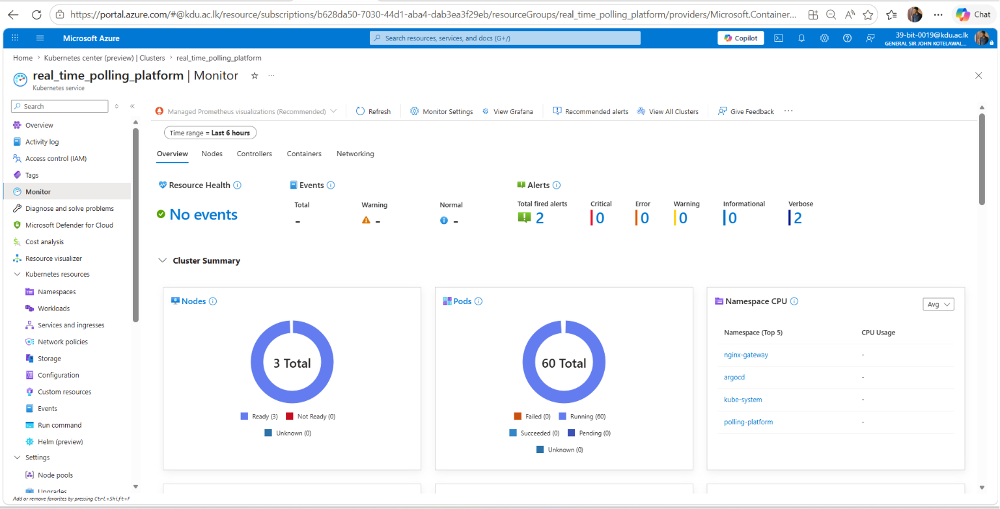

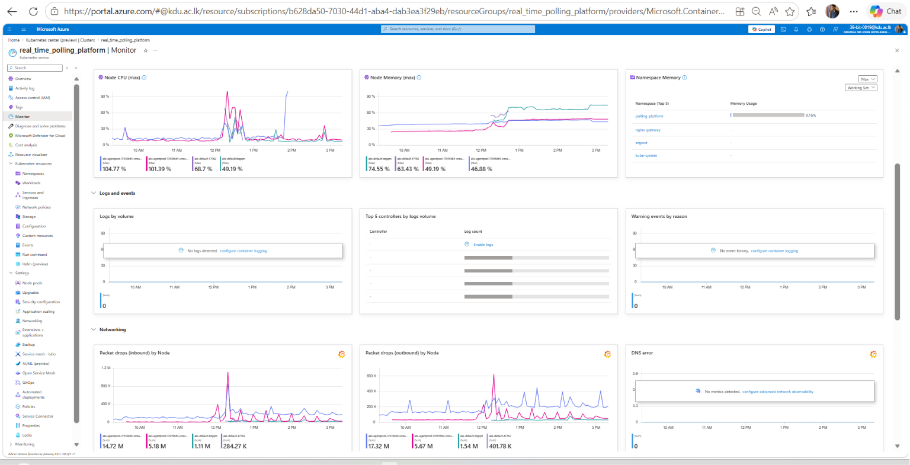

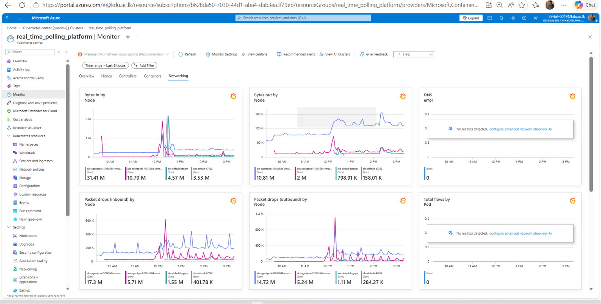

---

## Application Screenshots

### Public Voting Page
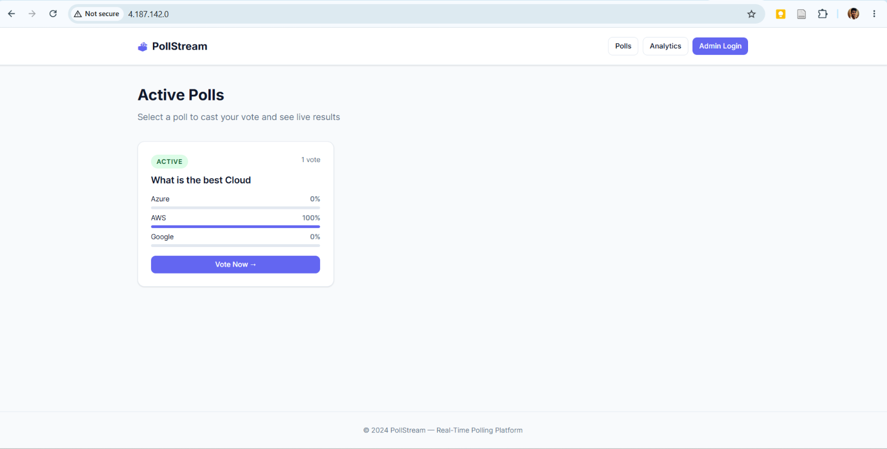

### Vote Page with Live Results
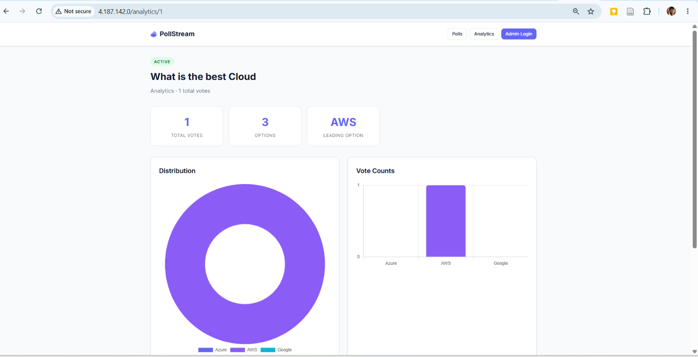

### Admin Dashboard
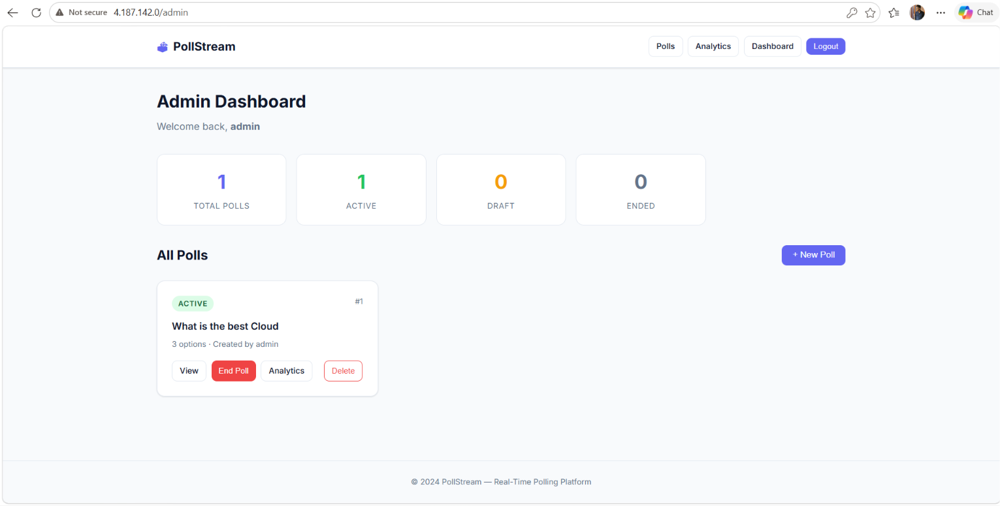

### Analytics
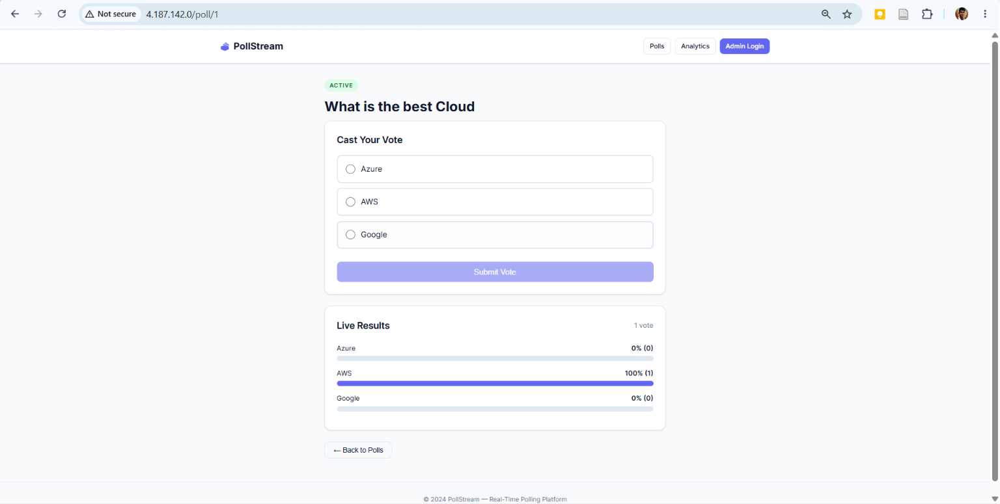

---

## Local Development

### Prerequisites

- Docker Desktop
- Java 17 + Maven
- Python 3.11 + pip
- Node.js 20

### Run with Docker Compose

```bash
cp .env.example .env       # fill in secrets
docker-compose up -d       # starts all 8 services
```

| Service | Local URL |
|---|---|
| Frontend | http://localhost:3000 |
| Auth | http://localhost:8081 |
| Poll | http://localhost:8082 |
| Vote | http://localhost:8083 |
| Analytics | http://localhost:8084 |
| Realtime | http://localhost:3001 |

### Connect to AKS

```bash
az account set --subscription b628da50-7030-44d1-aba4-dab3ea3f29eb
az aks get-credentials \
  --resource-group real_time_polling_platform \
  --name real_time_polling_platform
kubectl get pods -n polling-platform
```

---

## Project Structure

```
cloud-native-polling-platform/
├── auth-service/          # Spring Boot — JWT auth
├── poll-service/          # Spring Boot — Poll management
├── vote-service/          # Spring Boot — Voting + Redis pub/sub
├── analytics-service/     # FastAPI — Statistics & aggregation
├── realtime-service/      # Node.js + Socket.IO — WebSockets
├── frontend/              # React 18 — Voting UI + Admin dashboard
├── k8s/                   # Kubernetes manifests (ArgoCD source)
├── azure-pipelines/       # Azure DevOps CI pipeline definitions
├── docs/                  # Architecture diagrams and screenshots
├── docker-compose.yml     # Local development
└── init-db.sql            # Database schema seed
```
